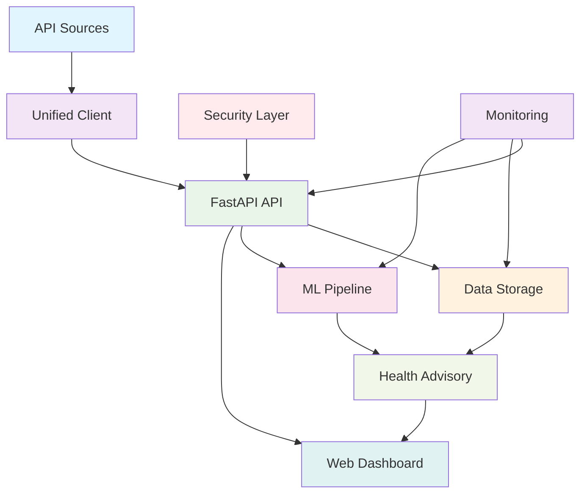

# AirGuard - Real-Time Air Quality & Health Risk Prediction & Advisory System

Advanced, production-ready system for monitoring, predicting, and providing health advisories for air quality in urban and peri-urban areas using real-time APIs and advanced machine learning.

## 🌟 Features

### 🔐 Enhanced Security
- **JWT Authentication**: Secure user authentication with JSON Web Tokens
- **Role-based Access Control**: Admin, User, and Viewer roles with granular permissions
- **API Key Management**: Secure API key generation and validation
- **Rate Limiting**: Prevent API abuse with configurable rate limits
- **Password Hashing**: Secure password storage with bcrypt hashing
- **User Registration & Login**: Full user management system with personalized profiles

### 🔄 Real-Time Data Processing
- **Multiple API Integration**: OpenWeatherMap, AirVisual, AQICN, OpenAQ with automatic fallback
- **Data Confidence Scoring**: Based on latency, consistency, and freshness
- **Urban & Peri-urban Monitoring**: AI-powered classification and specialized monitoring
- **Real-time Processing**: Scheduled data ingestion every 10 minutes
- **Data Quality Assurance**: Automated validation and quality scoring

### 🤖 Advanced Machine Learning
- **Hybrid Deep Learning**: CNN-LSTM for spatio-temporal predictions
- **Ensemble Models**: Random Forest, XGBoost, LSTM for robust predictions
- **Explainable AI (XAI)**: SHAP and LIME for model interpretability
- **AutoML Pipeline**: Automatic hyperparameter optimization
- **Real-time Incremental Learning**: Adaptive model updates
- **Source Attribution**: Identify pollution sources (traffic, crop burning, weather)
- **Policy Simulation**: What-if scenario analysis

### 🏥 Health Risk Assessment
- **6-Level Risk Categorization**: Good to Hazardous
- **Vulnerable Population Support**: Children, elderly, asthma patients
- **Personalized Health Profiles**: User-specific risk assessment based on age, health conditions, and lifestyle
- **Cumulative Exposure Tracking**: Long-term exposure monitoring
- **Multi-language Support**: Hindi and regional language advisories
- **Emergency Alert System**: SMS, Email, Push notifications

### 📊 Advanced Analytics Dashboard
- **Real-time Visualization**: Live charts and maps
- **AI Insights Panel**: Automated insights and recommendations
- **Voice Interface**: Voice-enabled queries and advisories
- **GeoHeatmap**: Interactive pollution heatmaps with colored areas based on AQI
- **Auto Location Detection**: Automatic geolocation for personalized air quality data
- **Role-based Dashboards**: Admin, Citizen, Health Department views
- **Mobile-responsive**: PWA support for mobile devices

### 🚀 Production-Ready Architecture
- **FastAPI Backend**: Async RESTful API with WebSocket support
- **Database Storage**: SQLite (dev) / PostgreSQL (prod) with TimescaleDB
- **Redis Caching**: Intelligent caching layer
- **Docker Deployment**: Containerized architecture
- **Monitoring**: Prometheus and Grafana integration
- **CI/CD Ready**: GitHub Actions workflows

## 🏗️ System Architecture



## 🚀 Quick Start

### Prerequisites
- Python 3.11+
- Redis (for caching)
- PostgreSQL (optional, for production)
- API keys for air quality APIs

### Installation

1. **Clone the repository**:
   ```bash
   git clone <repository-url>
   cd AirGuard
   ```

2. **Create virtual environment**:
   ```bash
   python -m venv venv
   source venv/bin/activate  # On Windows: venv\Scripts\activate
   ```

3. **Install dependencies**:
   ```bash
   pip install -r requirements.txt
   ```

4. **Configure environment**:
   ```bash
   cp .env.example .env
   # Edit .env and add your API keys and security settings
   ```

5. **Initialize database**:
   ```bash
   python -m src.data.storage
   ```

6. **Run the API server**:
   ```bash
   uvicorn src.api.main:app --host 0.0.0.0 --port 8000 --reload
   ```

7. **Access the applications**:
   - API: http://localhost:8001
   - API Docs: http://localhost:8001/docs
   - Web Dashboard: http://localhost:8050
   - Health Check: http://localhost:8001/health

## 🔐 Authentication

AirGuard now features a comprehensive user authentication system:

### User Registration
Users can register with personalized health profiles:
- Full name, mobile number, email
- Age and address
- Chronic health conditions (asthma, diabetes, etc.)
- Lifestyle factors (smoking, outdoor work)

### User Login
Users can login with mobile number or email and password.

### Default Credentials
- **Admin User**: `admin` / `admin123` (for administrative tasks)

### Authentication Endpoints

#### User Registration
```bash
curl -X POST "http://localhost:8001/api/v1/auth/register" \
     -H "Content-Type: application/json" \
     -d '{
       "full_name": "John Doe",
       "mobile": "9876543210",
       "email": "john@example.com",
       "age": 30,
       "address": "123 Main St, City",
       "chronic_conditions": "asthma",
       "is_smoker": false,
       "works_outdoors": true,
       "password": "securepassword",
       "confirm_password": "securepassword"
     }'
```

#### User Login
```bash
curl -X POST "http://localhost:8001/api/v1/auth/login" \
     -H "Content-Type: application/json" \
     -d '{
       "identifier": "9876543210",  // or email
       "password": "securepassword"
     }'
```

#### Create API Key (Admin only)
```bash
curl -X POST "http://localhost:8001/api/v1/auth/api-key" \
     -H "Content-Type: application/json" \
     -H "Authorization: Bearer your-admin-token" \
     -d '{
       "name": "mobile-app-key"
     }'
```

## 📖 API Usage Examples

### Get Current Air Quality (Requires Authentication)
```bash
curl -X GET "http://localhost:8001/api/v1/air-quality/current?latitude=28.6139&longitude=77.2090" \
     -H "Authorization: Bearer your-user-token"
```

### Generate Predictions (Requires Authentication)
```bash
curl -X POST "http://localhost:8001/api/v1/predictions/generate" \
     -H "Content-Type: application/json" \
     -H "Authorization: Bearer your-user-token" \
     -d '{
       "location_id": "Delhi",
       "latitude": 28.6139,
       "longitude": 77.2090,
       "prediction_horizon": 24
     }'
```

### Get Personalized Health Advisory (Requires Authentication)
```bash
curl -X GET "http://localhost:8001/api/v1/advisory/health?aqi=150" \
     -H "Authorization: Bearer your-user-token"
```

### Get Air Quality Hotspots (Requires Authentication)
```bash
curl -X GET "http://localhost:8001/api/v1/air-quality/hotspots?lat=28.6139&lon=77.2090" \
     -H "Authorization: Bearer your-user-token"
```

## 🗺️ Auto Location & Map Features

### Auto Location Detection
- Upon login, the dashboard automatically detects the user's location using browser geolocation
- Fetches air quality data for the current location
- Displays colored AQI markers on an interactive map

### Personalized Health Advisories
- Health advisories are personalized based on:
  - User's age (child, adult, elderly)
  - Chronic conditions (asthma, heart disease, diabetes)
  - Lifestyle factors (smoking, outdoor work)
- More targeted recommendations for vulnerable populations

### Colored Map Visualization
- Interactive map showing air quality hotspots
- Color-coded markers based on AQI values:
  - Green (0-50): Good
  - Yellow (51-100): Moderate
  - Orange (101-150): Unhealthy for Sensitive Groups
  - Red (151-200): Unhealthy
  - Purple (201-300): Very Unhealthy
  - Maroon (301+): Hazardous
- User's location marked with a blue dot

## 🔧 Configuration